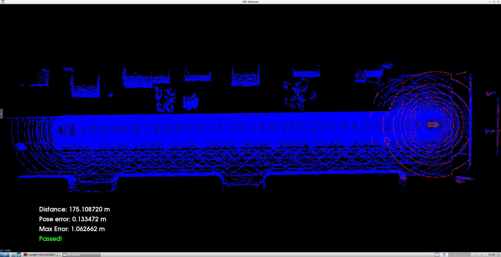
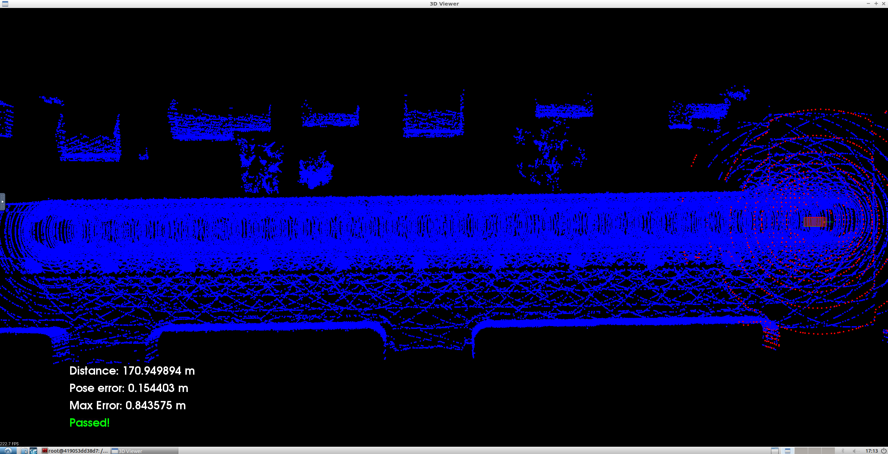

# Scan Matching Localization

This repo contains the C++ code needed to simulate both ICP and NDT scan matching localization algorithms on the CARLA simulator. Both of 
these algorithms will get the simulated car through 170 meters of road without exceeding a pose error of 1.2 meters.

### ICP Results

### NDT Results

